# Demcon Festival Simulator

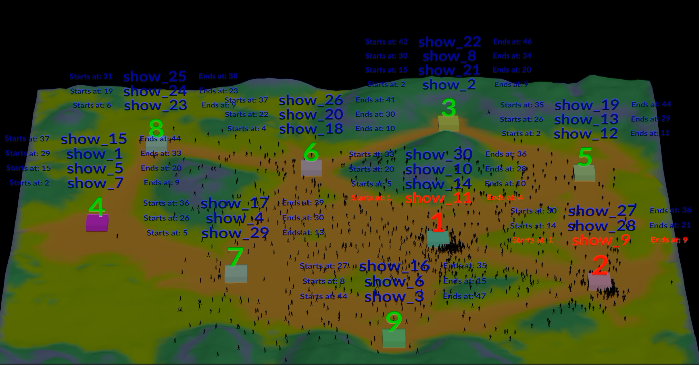

##

As a Houdini artist ( soon to be Synthetic Data Engineer at Demcon! ), I couldn't resist doing this challenge in Houdini.

As far as using Python; I used Python (inside Houdini) to make the main festival scheduler.

I added a copy of the code in "scripts/scheduler.py" that is used inside Houdini. I commented out some of the Houdini related code, so it should be able to run from a command line (use data/data_sheet.csv to test).

The output is pushed downstream to procedurally create a festival overview in Houdini.

All 1100+ Demcon employees are attending this festival. Make sure you plan ahead, because you have little time to go from one to the next, as you can see in the preview ;)

**Click below to see the preview video:**

[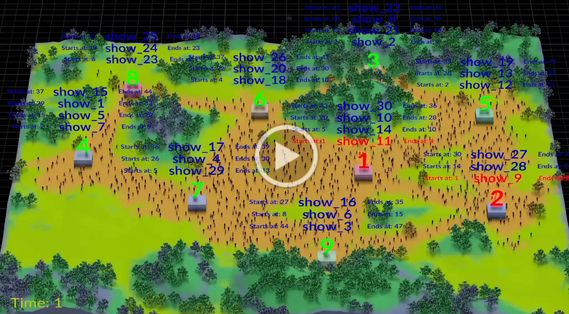]( https://drive.google.com/file/d/1wzf1vK6FQn2MKWZ9W07eOYgYbjpq0Thf/view?usp=sharing )

^ PLAY THE PREVIEW BY CLICKING ABOVE ^

## Comments

Created using Houdini 20.5.332 Py 3.11

Python code can be found in "scripts/scheduler.py" that is used in the Python node inside Houdini.  

## Setup overview:

Everything is procedural generated, based on the amount of stages, start and end time.

See Houdini .hip file for the complete workflow.

Some key points:

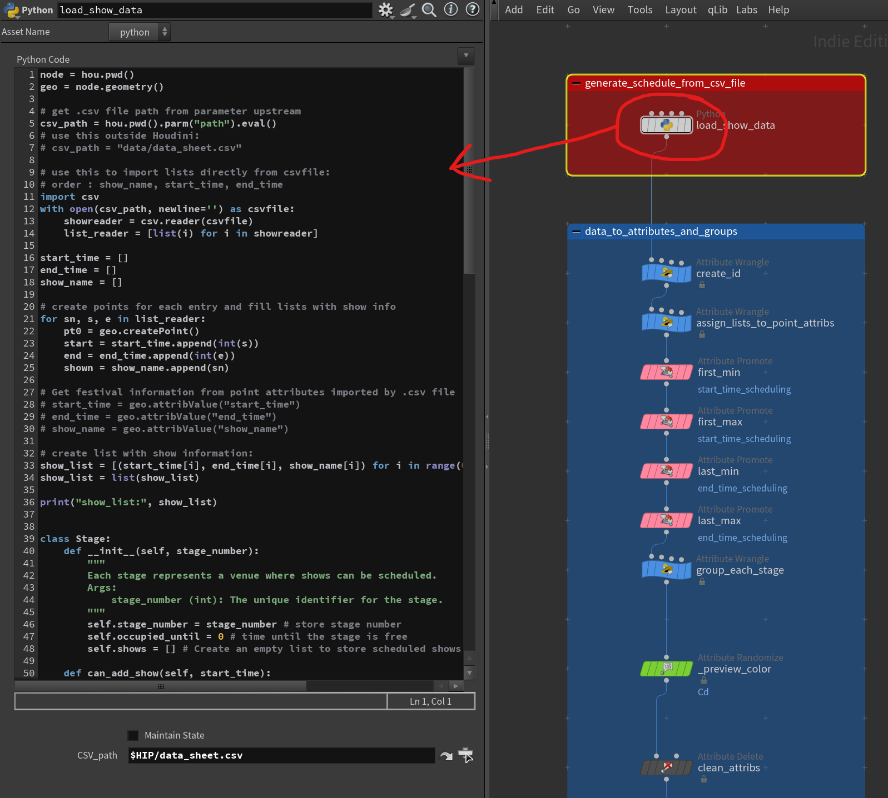
*Here in the Python SOP node it generates the schedule based on the input .csv.
It generates points based on the amount of shows found in the .csv file. Everything is put into an array and promoted to attributes to be used downstream.*

##

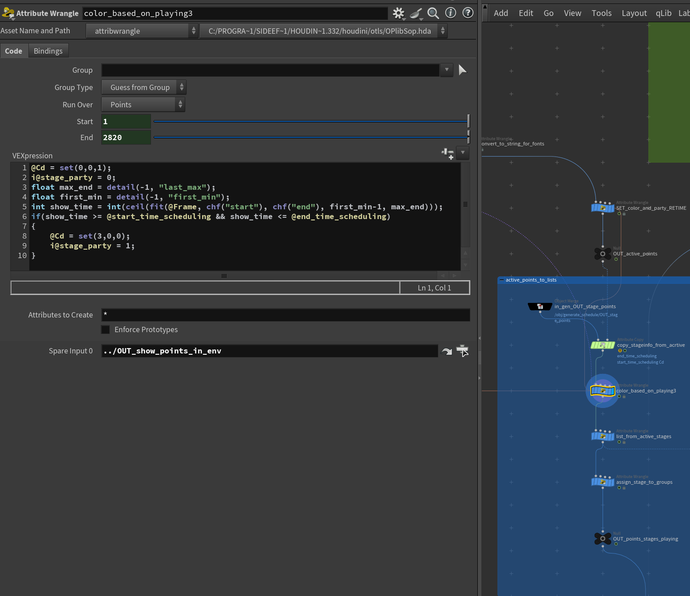
*Here the shows are retimed, based on the first start and last end time, so it is usable inside the crowd solver.
i@stage_party = 1 when a stage is active. This will be used later on.*

##

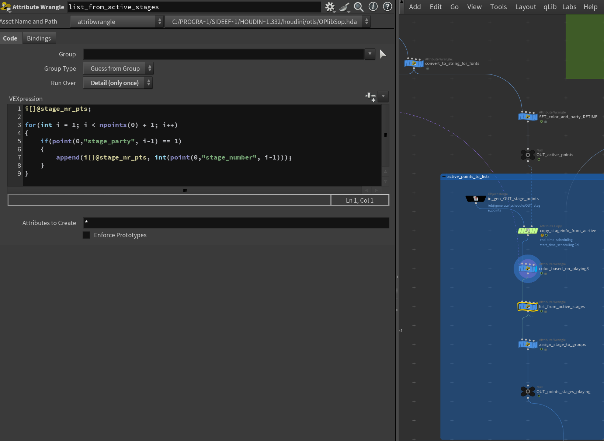
*If a stage is active append it to a list. This is updating every frame.*

##

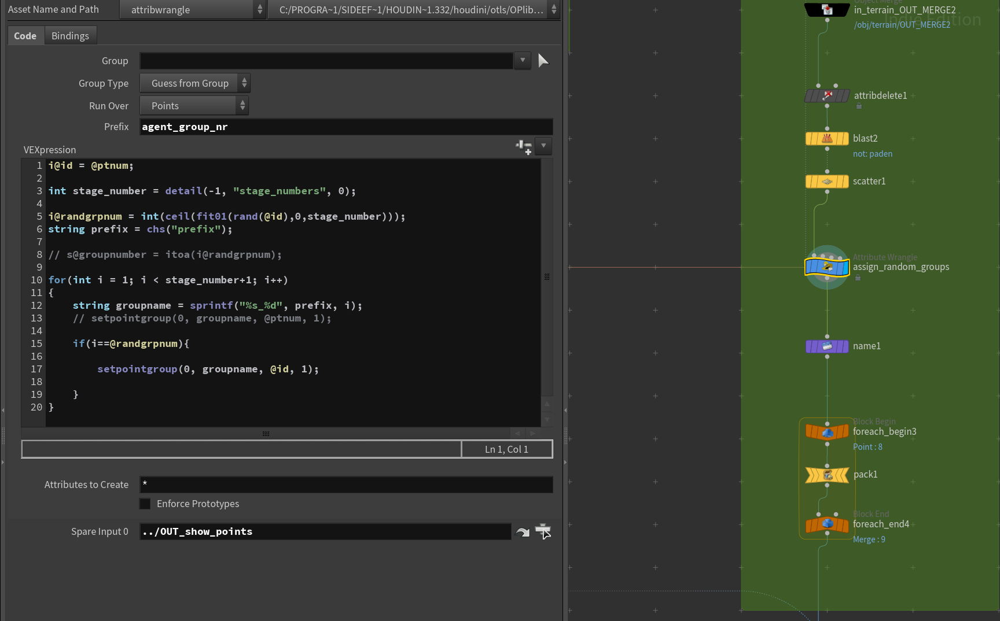
*There are 1100 (Demcon employees) crowd agents being created by scattering 1100 points on a grid (size based on amount of shows). The agents are being randomly grouped based on the amount of stages there are. This is because it will be easier to assign stages to the groups. The groups are being packed, so we end up with 9 points in this example.*

##

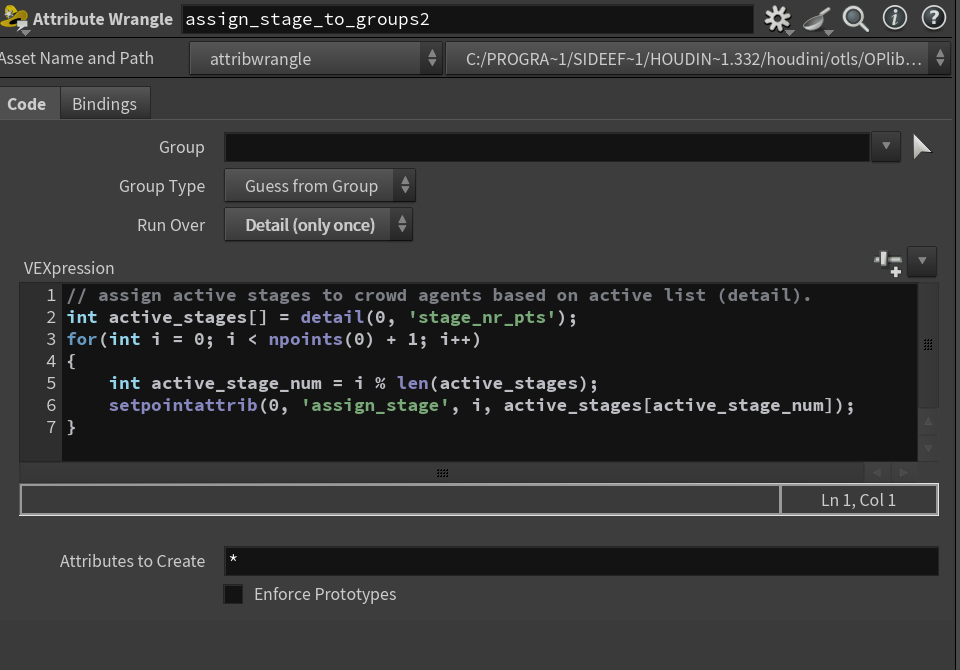
*each group gets assigned a stage number so it can be used as a goal object in the solver later on. The assignment is done by the group number % the amount of stages that are active. This was the easiest way to divide the groups equally.*

##

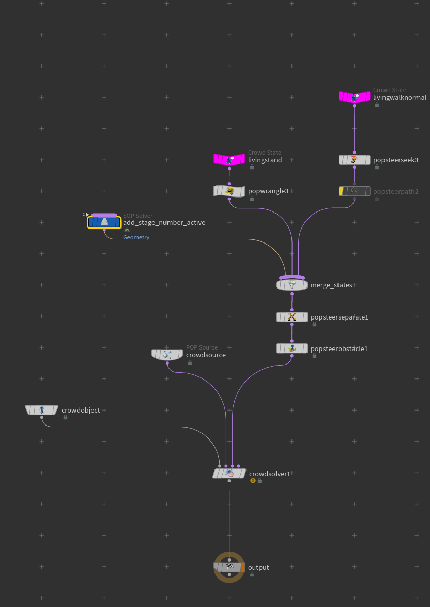
*Inside the crowd solver; the sop solver (add_stage_number_active). Is getting and updating what stage number is assigned to the crowd agent. Based on that we can create a goal object.*

##

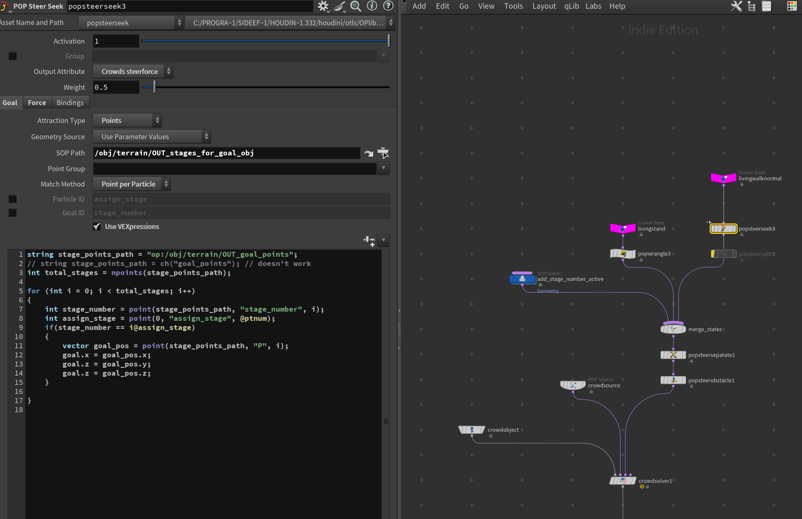
*By using a crowd steerforce the agents can be directed to the active stage.
By checking if the stage_number that is active (on the stage points) == as the assigned stage number on the crowd group. Then we get the position of the stage and add this as a goal object to the agent.*

##

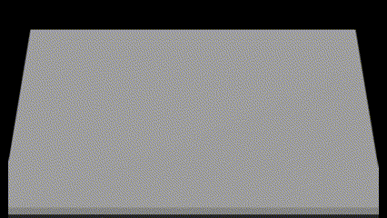
##
*Terrain is generated based on the amount of shows and amount of stages.
When there are for example 5 shows, with 3 stages, the terrain will resize based on those attributes. Masks are being created by connecting the stages to each other by shortest path.*

##

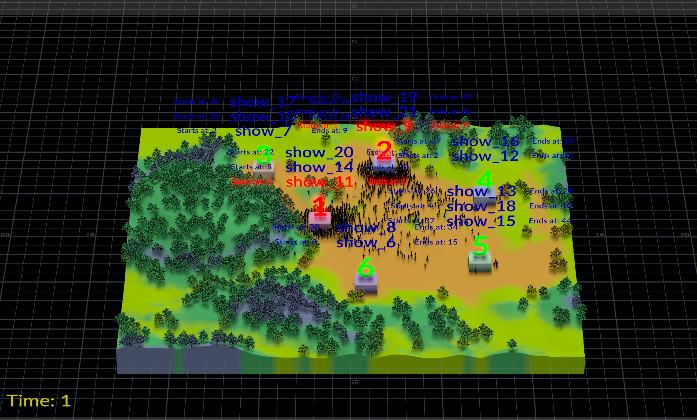
*When you change the input in the .csv file, everything is changing accordingly.*

##