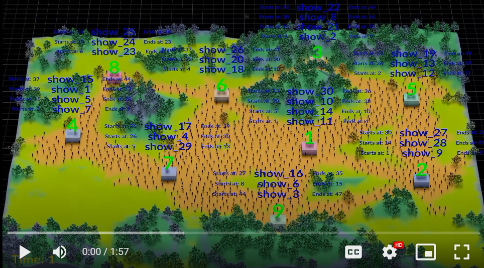

# Demcom Festival Schedulation

## Intro

As a Houdini artist ( and soon to be Synthetic Data Engineer at Demcon! ), I couldn't resist doing this challenge in Houdini.

As far as using python; I used python (inside Houdini) to make main festival scheduler.

I added the code in "scripts/scheduler.py" that is used inside Houdini. I commented out some of the Houdini related code, so it should be able to run from a commandline.

The output is pushed downstream to proceduraly create a festival overview in Houdini.

All 1100+ Demcon employees are attending this festival. Make sure you plan ahead, because you have little time to go from one to the next, as you can see in the preview ;)

## Installation

Created using Houdini 20.5.332 Py 3.11

Python code can be found in "scripts/scheduler.py" that is used in the Python node inside Houdini.  

It should be able to run standalone.

## Usage